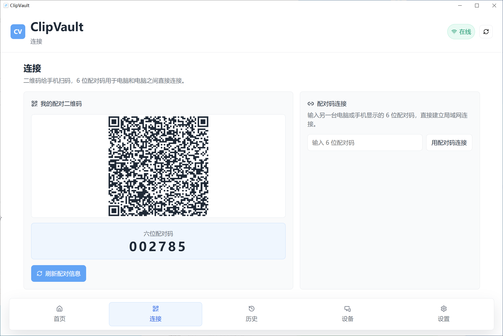
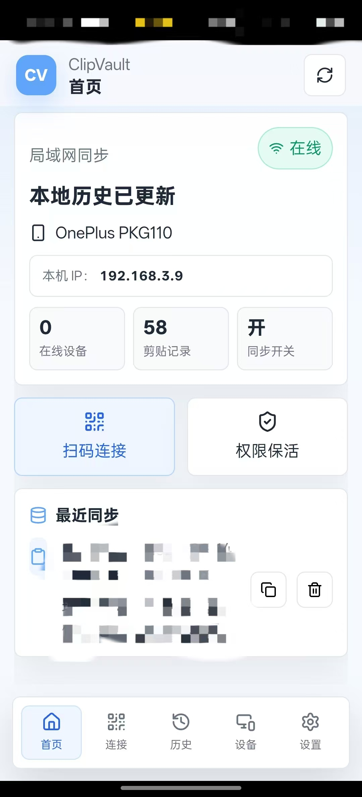
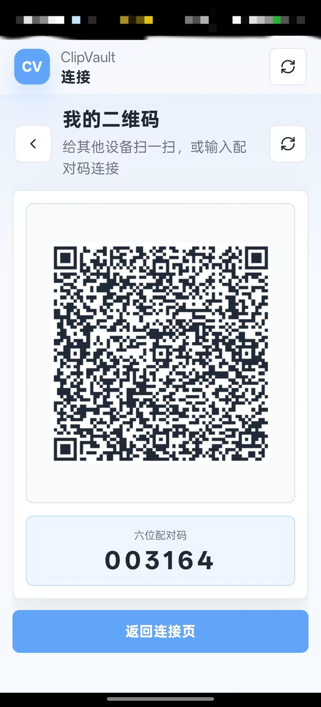
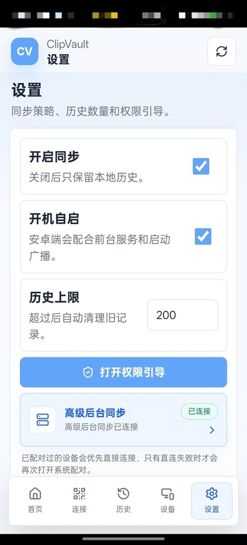

# ClipVault

[中文说明](README.md)


ClipVault is a LAN clipboard sync tool for Windows, Linux, Android, and iOS. It syncs clipboard content directly across devices on the same local network, without a cloud server, public IP address, or port forwarding.

In one sentence: ClipVault is an open-source LAN clipboard sync app that automatically syncs copied text and images between Windows and Android system clipboards.

Keywords: clipboard sync, LAN clipboard, cross-device copy, Windows Android clipboard, local network sync, ADB clipboard, QR pairing.

## Download

- [Open Releases and download the latest version](https://github.com/13131633633/ClipVault/releases)
- Windows users can download `ClipVault-Windows-Setup-*.exe` or `ClipVault-Windows-Portable-*.exe`
- Android users can download `ClipVault-Android-debug-*.apk`
- See [CHANGELOG.md](CHANGELOG.md) for release notes

## Quick Start

### Option 1: Use the Windows release

1. Open the GitHub Releases page.
2. Download the Windows installer or portable EXE from the Releases page.
3. Install and start ClipVault on Windows.
4. Install the Android APK on your phone.
5. On Windows, open the Connect tab and show the pairing QR code.
6. On Android, tap Scan and scan the Windows QR code.
7. To keep Android clipboard sync active while the app is in the background, enable Advanced Background Sync.

Release assets:

- [GitHub Releases](https://github.com/13131633633/ClipVault/releases)

### Option 2: Run the Windows desktop app from source

```bash
npm install
npm run dev:desktop
```

Build the Windows desktop package:

```bash
npm run build:desktop
```

### Option 3: Build Android from source

```bash
cd android
gradlew.bat assembleDebug
```

Standard APK output:

```text
android/app/build/outputs/apk/debug/app-debug.apk
```

## Screenshots

### Windows Desktop



### Android Home



### Android Pairing QR Code



### Android Settings



## What This Project Is

ClipVault is primarily a Node.js project with native hosts, not a single-platform native project.

- Windows / Linux desktop: `Electron + Node.js + React`
- Android: `Capacitor + React UI + Kotlin`
- iOS: `Capacitor + React UI + Swift`

The desktop app is not a C#, WPF, Qt, Java Swing, or Python desktop project. Desktop development, running, and packaging are managed through `package.json`.

## Features

- LAN QR-code pairing
- Six-digit pairing code connection
- Real-time bidirectional clipboard sync
- Text and PNG image clipboard support
- Local clipboard history
- Search, copy, delete, and clear history
- Multiple paired devices
- Device management and manual disconnect
- Windows / Linux tray support
- Android foreground service, boot receiver, permission guide, and ADB-assisted background sync

## Android Advanced Background Sync

Android 10 and newer restrict background clipboard access. ClipVault uses a foreground service plus an ADB-assisted clipboard agent to keep clipboard reading active while the app is not on screen.

### Method A: Wireless debugging pairing

Recommended for Android 11+ devices with Wireless debugging.

1. Open Android Settings.
2. Open About phone.
3. Tap Build number seven times until Developer options are enabled.
4. Go back to Settings.
5. Open Developer options.
6. Enable Wireless debugging.
7. Open ClipVault.
8. Open Settings or Connect.
9. Tap Advanced Background Sync.
10. In the system Wireless debugging page, tap Pair device with pairing code.
11. Keep the system pairing dialog open.
12. Pull down the notification shade.
13. Find the ClipVault Advanced Background Sync notification.
14. Tap Enter pairing code.
15. Type the six-digit system pairing code.
16. Wait until ClipVault shows that Advanced Background Sync is connected.

After the first successful pairing, ClipVault will try to reconnect automatically when the app starts, when the foreground service restarts, or when the device boots.

### Method B: USB ADB TCP/IP helper

Use this when the phone does not support Wireless debugging, or when the ROM has an unreliable Wireless debugging implementation.

Requirements:

- Developer options enabled
- USB debugging enabled
- Phone connected to the computer over USB
- Phone connected to Wi-Fi
- `adb` available on the computer, usually from Android Studio Platform Tools

Run:

```bat
scripts\android-adb-tcpip.bat
```

The script will:

- verify that the USB debugging device is online
- switch ADB to TCP/IP mode
- read the phone Wi-Fi IP address
- run `adb connect phone-ip:5555`
- apply background-related appops and device idle whitelist settings for ClipVault
- start ClipVault

## Pairing Code Rule

ClipVault uses a fixed LAN service port for pairing-code connections. The six-digit code is designed for common home and office `/24` networks:

- first three digits: the target device IP's last segment, padded to three digits
- last three digits: the current session verifier

Example:

- Windows IP: `192.168.31.86`
- Pairing code: `086314`
- Android on the same Wi-Fi enters `086314`
- ClipVault tries `192.168.31.86:<fixed-port>`
- The target verifies `314` before accepting the connection

QR-code pairing still contains the full IP, port, device ID, and token, so it is the most convenient option for phone-to-computer pairing.

## Repository Layout

```text
.
├─ android/              Android Studio project
├─ assets/               shared icons and desktop assets
├─ docs/                 protocol and documentation assets
├─ electron/             Electron main process, tray, and TCP service
├─ ios/                  Xcode project
├─ public/               static web assets
├─ scripts/              helper scripts
├─ src/                  shared React UI and bridge layer
├─ dist/                 web build output
├─ release/              Electron packaging output
├─ capacitor.config.ts   Capacitor config
├─ package.json          Node.js project entry
└─ README.md
```

## Build Requirements

### Common

- Node.js 24+
- npm 11+

### Windows / Linux Desktop

- No local Python, Rust, or Go runtime is required.
- Electron packaging resources are downloaded during the first desktop build.

### Android

- Android Studio Koala or newer
- Android SDK Platform 36
- JDK 17 or newer
- `adb` in PATH for the USB helper script

### iOS

- macOS with Xcode 16 or newer
- iOS 16+ simulator or device

## Development Commands

Install dependencies:

```bash
npm install
```

Run the web UI preview:

```bash
npm run dev
```

Run the desktop app:

```bash
npm run dev:desktop
```

Build web assets:

```bash
npm run build
```

Sync web assets to Android and iOS:

```bash
npm run sync:native
```

Open Android Studio:

```bash
npm run open:android
```

Open Xcode:

```bash
npm run open:ios
```

Package the desktop app:

```bash
npm run build:desktop
```

## Protocol

ClipVault uses a unified LAN TCP long connection. See [docs/PROTOCOL.md](docs/PROTOCOL.md).

- frame format: `4-byte big-endian length + UTF-8 JSON`
- key messages: `hello`, `welcome`, `clipboard_update`
- supported clipboard payloads: `text/plain`, `image/png`

## Important Android Notes

ClipVault includes:

- foreground data sync service
- boot receiver
- watchdog alarm
- periodic worker
- notification permission flow
- battery optimization guide
- ADB direct reconnect after first pairing

Android and vendor ROMs can still kill background processes during aggressive battery saving or device cleanup. For best results, allow notifications, disable battery restrictions for ClipVault, enable autostart, and keep Advanced Background Sync connected.

## Validation

The project has been validated with:

```bash
npm run build
npm run lint
npm run sync:native
android/gradlew.bat assembleDebug
npm run build:desktop
node --check electron/main.mjs
node --check electron/desktop-service.mjs
node --check electron/preload.mjs
```

iOS compilation requires macOS and Xcode, so it cannot be fully validated from this Windows workspace.

## License

ClipVault is released under the [MIT License](LICENSE).
